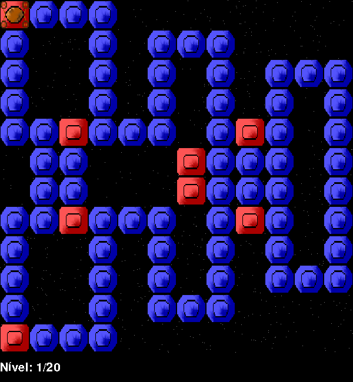

# Pod clone

Implementation of POD in pygame. The game is based on [POD](http://www.arkangles.com/pod/) by SwordSoft.

This project was developed for the [Programming Fundamentals Unit](https://sigarra.up.pt/feup/en/UCURR_GERAL.FICHA_UC_VIEW?pv_ocorrencia_id=419983).

To run the game you just have to download all the files, put them in the same directory and run the POD.py file.

## Screenshot

* [Video here](https://www.youtube.com/watch?v=5A8JsTpnlYw)

